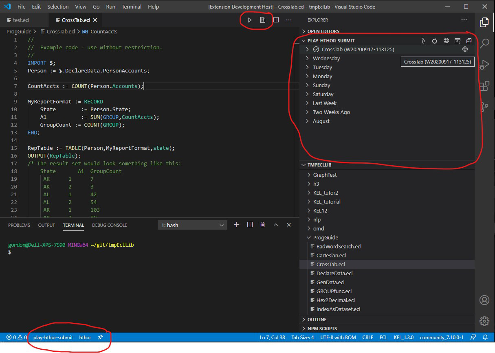

# ECL for Visual Studio Code
_For list of latest changes, please see the  [Change Log](https://github.com/hpcc-systems/vscode-ecl/blob/master/CHANGELOG.md) at the main [GitHub](https://github.com/hpcc-systems/vscode-ecl) repository._

This extension adds rich language support for [HPCC Systems](https://hpccsystems.com/) [ECL language](https://hpccsystems.com/training/documentation/ecl-language-reference/html) (for the [HPCC-Platform](https://github.com/hpcc-systems/HPCC-Platform)) to VS Code, including:

* Syntax highlighting
* Auto completion
* Client tools discovery and integration
* HPCC-Platform server support

## Version 2 Highlights



| Command                   | Shortcut | Description                                                      |
|---------------------------|:--------:|------------------------------------------------------------------|
| Submit | F5 | Submit ECL |
| Compile | | Compile ECL |
| My workunits | | Toggle between "My" and "All" Workunits |
| All workunits | | Toggle between "My" and "All" Workunits |
| ECL Watch | | Launch ECL Watch |
| Switch Platform | | Switch HPCC Platform instance |

---

## Installation

* Install Visual Studio Code. 
* In VS-Code, open the command palette (`ctrl/cmd + shift + p`) and select `Install Extension`.  Enter `ecl` to filter the available extensions and choose `ECL Language by HPCC Systems`.
* Locate and install the appropriate ECL Client Tools from [hpccsystems.com](https://hpccsystems.com/download/archive)

## ECL

### ECL Commands

The following ECL specific commands are available.  Note:  These commands will **not** be active until an ECL file has been opened (as this triggers the extension to load).  To activate a command either use its associated hotkey or press `ctrl/cmd + shift + p` and type `ECL` this will present a filtered list of the ECL specific commands:

#### Global:

| Command                   | Shortcut | Description                                                      |
|---------------------------|:--------:|------------------------------------------------------------------|
| Syntax Check All Files | shift + F7 | Save All + check syntax of all files. |
| Syntax Clear | ctrl + F7 | Clear all previously reported ECL Syntax Check results |
| Language Reference Website | | Opens the ECL language reference website in external browser |
| Terminal | | Opens ECL Client Tools Terminal Session |

#### Within the ECL Code Editor:

| Command                   | Shortcut | Description                                                      |
|---------------------------|:--------:|------------------------------------------------------------------|
| Submit | F5 | Submit ECL |
| Compile | | Compile ECL |
| Syntax Check | F7 | Save and check syntax of current file |
| Language Reference Lookup | shift + F1 | For the currently selected text, search the online ECL language reference |

#### Within the Workunit Tree:

| Command                   | Shortcut | Description                                                      |
|---------------------------|:--------:|------------------------------------------------------------------|
| My workunits | | Toggle between "My" and "All" Workunits |
| All workunits | | Toggle between "My" and "All" Workunits |
| Refresh | | Refresh Tree |
| ECL Watch | | Launch ECL Watch in external browser |
| Switch Platform | | Switch HPCC Platform instance (launch configuration) | 

#### Within the Status Bar

| Command                   | Shortcut | Description                                                      |
|---------------------------|:--------:|------------------------------------------------------------------|
| Launch Configuration | | Click to select launch configuration |
| Target Cluster | | Click to select target cluster |
| Pin | | Pin current launch configuration and target cluster to current document |
| Client Tools | | Click to select client tools version |

#### ECL Settings

The following Visual Studio Code settings are available for the ECL extension.  These can be set in user preferences (`ctrl/cmd + ,`) or directly in your current workspace (`.vscode/settings.json`):

```javascript

  // eclcc syntax check arguments.
  "ecl.syntaxArgs": ["-syntax"],

  // Run 'eclcc -syntax' on save.
  "ecl.syntaxCheckOnSave": true

  // Run 'eclcc -syntax' on load.
  "ecl.syntaxCheckOnLoad": true

  // Additional folders to use when resolving IMPORT statements.
  "ecl.includeFolders": []

  // Override eclcc auto detection.
  "ecl.eclccPath": ""

  // Write eclcc logfile to specified file.
  "ecl.eclccLogfile": ""

  // Add '-legacy' argument to eclcc.
  "ecl.legacyMode": false

  // Debug level logging (requires restart).
  "ecl.debugLogging": false

```

#### ECL Launch Settings

Submitting ECL using VS-Code requires specifying the target environment within the VS Code `launch.json` (pressing `F5` will prompt you to auto create a skeleton file if none exists):

```javascript
// Default ECL Launch Configuration
{
  "name": "play-hthor-submit",
  "type": "ecl",
  "request": "launch",
  "mode": "submit",
  "program": "${file}",
  "protocol": "https",
  "serverAddress": "play.hpccsystems.com",
  "port": 18010,
  "rejectUnauthorized": false,
  "targetCluster": "hthor",
  "eclccPath": "${config:ecl.eclccPath}",
  "eclccArgs": [],
  "includeFolders": "${config:ecl.includeFolders}",
  "legacyMode": "${config:ecl.legacyMode}",
  "resultLimit": 100,
  "timeoutSecs": 60,
  "user": "vscode_user",
  "password": ""
}
```

## Building and Debugging the Extension

To set up a development environment for debugging the ECL for VS Code extension:

```bash
cd /Some/Dev/Folder/
git clone https://github.com/hpcc-systems/vscode-ecl
cd vscode-ecl
npm install
```

At which point you can open the `vscode-ecl` folder within VS Code.  

Next start the background build process by running the following command within a terminal session:

```bash
npm run watch
```

At which point you can edit the sources and launch debug sessions via **F5** and included launch configurations.

## KEL
_KEL is an optional language that can generate ECL._

### KEL Commands

The following KEL specific commands are available.  Note:  These commands will **not** be active until a KEL file has been opened (as this triggers the extension to load).  To activate a command either use its associated hotkey or press `ctrl/cmd + shift + p` and type `KEL` this will present a filtered list of the KEL specific commands:

#### Within the KEL Code Editor:

* Syntax Check **[F7]** - _Save + check syntax of current file._
* Generate ECL **[F5]** - _Save + generate ECL files._

#### Within the Status Bar
_Click on KEL Client Tools Version_

* Select Client Tools Version - Select Client Tools Version from available options.

#### KEL Settings

The following Visual Studio Code settings are available for the KEL extension.  These can be set in user preferences (`ctrl/cmd + ,`) or directly in your current workspace (`.vscode/settings.json`):

```javascript
  // Java runtime arguments (e.g. -Xmx12G).
  "kel.javaArgs": []

  // Override KEL auto detection
  "kel.kelPath": ""

  // Check syntax on save.
  "kel.syntaxCheckOnSave": true

  // Generated ECL location (Same Folder | Child Folder)."
  "kel.generateLocation": "Same Folder"

  // "Generate ECL on save."
  "kel.generateOnSave": false

  // Check syntax on load.
  "kel.syntaxCheckOnLoad": false
 
```

## License
[Apache-2.0](LICENSE)
