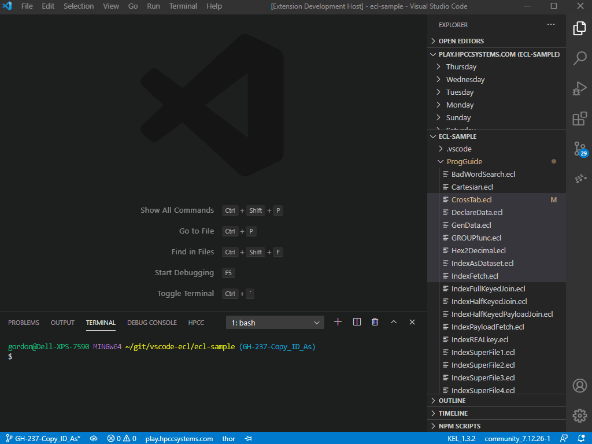
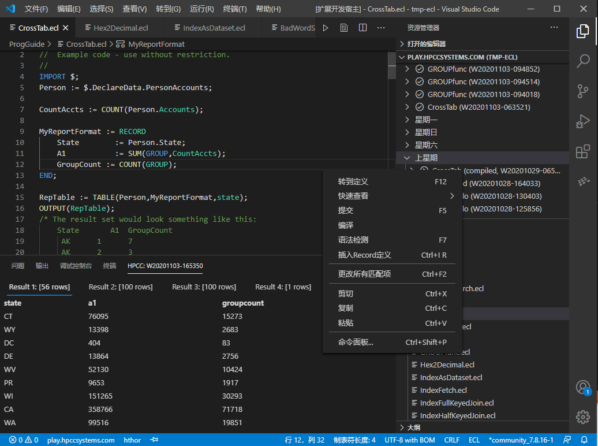
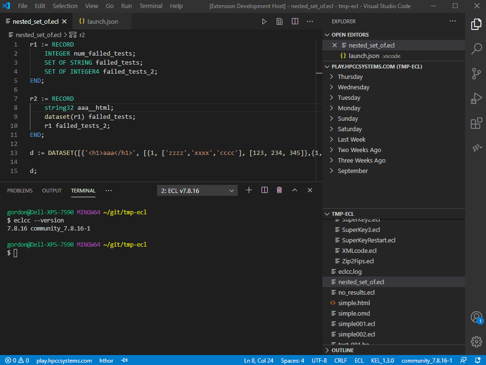
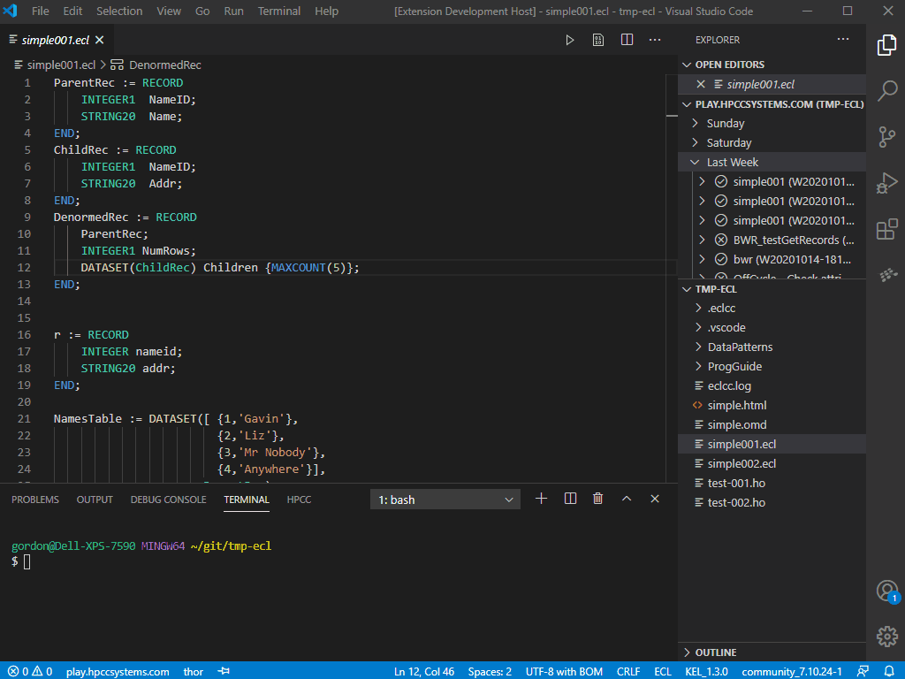
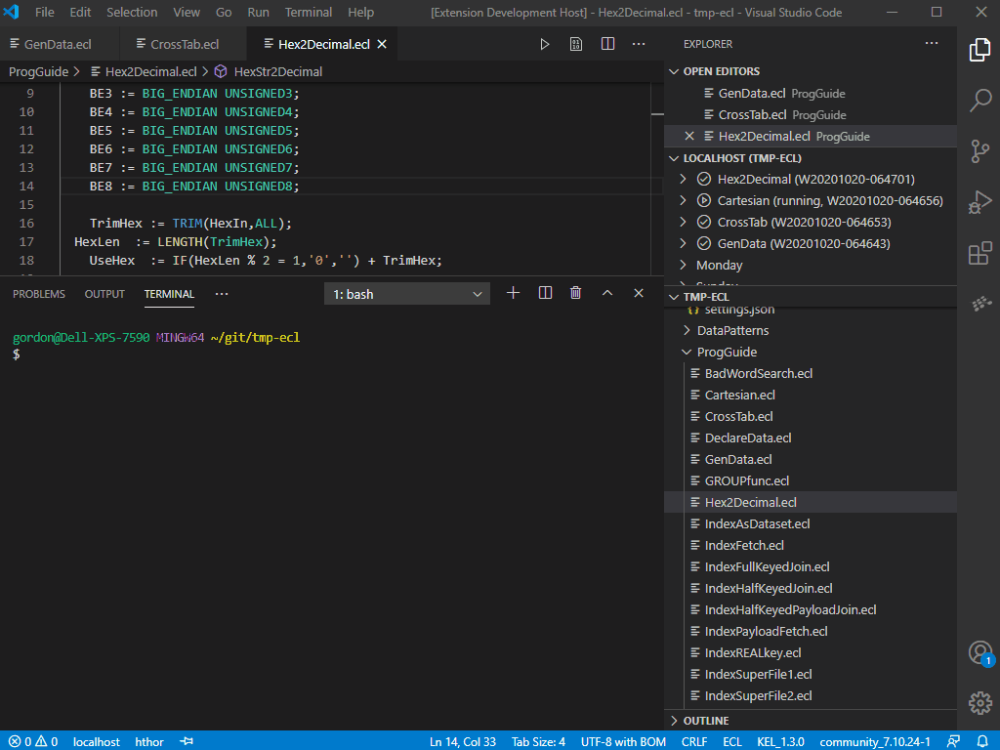
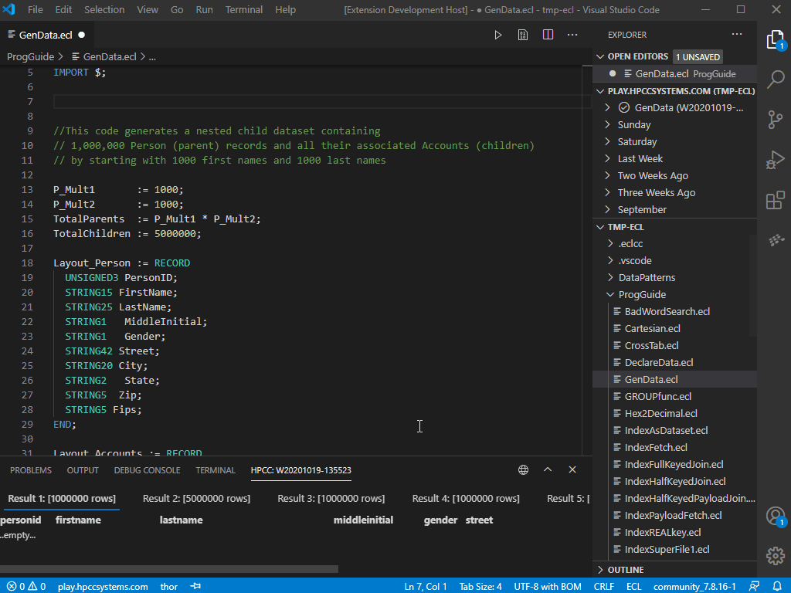

# ECL for Visual Studio Code
_For list of latest changes, please see the  [Change Log](https://github.com/hpcc-systems/vscode-ecl/blob/trunk/CHANGELOG.md) at the main [GitHub](https://github.com/hpcc-systems/vscode-ecl) repository._

This extension adds rich language support for [HPCC Systems](https://hpccsystems.com/) [ECL language](https://hpccsystems.com/training/documentation/ecl-language-reference/html) (for the [HPCC-Platform](https://github.com/hpcc-systems/HPCC-Platform)) to VS Code, including:

* Syntax highlighting
* Auto completion
* Client tools discovery and integration
* HPCC-Platform server support
* Integrated result viewer

## Recent Highlights

### v2.12.x
* Added "Copy as ECL ID" command to explorer and editor tab context menus



### v2.11.x
* Added "Import MOD file" command

### v2.10.x
* Enhanced digital signature support:
  * ECL: Verify ECL Signature

### v2.9.x

* KEL:
  * Optionally use grammar for syntax as you type checking (now off by default).
  * Improved syntax highlighting
  * Default syntax checking "on open" to `true`

### v2.8.x

* Added digital signature support:
  * ECL: Sign ECL

### v2.7.x

* Preliminary localisation support:
  * en
  * zh
  * pt-br
  * es



### v2.6.0

* Added HPCC resources page:
  * List of available bundles:
    * Install
    * Uninstall
    * Open homepage
  * List of available client tools
    * Select (force) specific version
    * Deselect forced version
    * Open terminal for specific version
    * Open download page for Client Tools



### v2.5.0

* Added context menu items for Workunits in the Workunit Tree:
  * Abort Workunit (only available for running WUs)
  * Delete Workunit (Only available for completed WUs)



### v2.4.0

* Added result viewer to bottom pane
* Added "Copy Results as ECL"



### v2.3.0

* Added list of "found" logical files to Insert Record Definition



### v2.2.0

* Added Insert Record Definition menu item

### v2.1.0

Reworked submission process:
* Launch configuration:
  * Simplified
  * Can be selected from the status bar
  * Can be pinned to specific ECL files
* Target Cluster:
  * Can be selected from the status bar
  * Can be pinned to specific ECL files
* Submit / Compile now available from:
  * Context menu
  * Top of editor
* Recent Workunits:
  * Tree view of recent workunits
  * Toggle between "Mine" and "All"
  * Open in external browser icon added to several locations

## Quick Start
_Version 2.x introduces a new streamlined submission process.  The "old" Run/Debug pane support has been deprecated and will be removed in the future._


1. Open folder
2. Open ECL file
3. Create Launch Configuration (if needed)
4. Select the target by:
    *  Clicking the "Launch Configuration" in the status bar
    *  Optionally clicking on the "Target Cluster" in the status bar
4. Monitor Workunit in the "Workunit History" pane
5. Click on Workunit to view results / issues in the bottom pane

## ECL

### ECL Commands

The following ECL specific commands are available.  Note:  These commands will **not** be active until an ECL file has been opened (as this triggers the extension to load).  To activate a command either use its associated hotkey or press `ctrl/cmd+shift+p` and type `ECL` this will present a filtered list of the ECL specific commands:

#### Global:

| Command                   | Shortcut | Description                                                      |
|---------------------------|:--------:|------------------------------------------------------------------|
| Syntax Check All Files | shift+F7 | Save All + check syntax of all files. |
| Syntax Clear | ctrl/cmd+F7 | Clear all previously reported ECL Syntax Check results |
| Import '.mod' file | | Import MOD file into workspace |
| Language Reference Website | | Opens the ECL language reference website in external browser |
| Terminal | | Opens ECL Client Tools Terminal Session |

#### Within the ECL Code Editor:

| Command                   | Shortcut | Description                                                      |
|---------------------------|:--------:|------------------------------------------------------------------|
| Submit | F5 | Submit ECL |
| Compile | | Compile ECL |
| Syntax Check | F7 | Save and check syntax of current file |
| Sign ECL | | Digitally sign ECL file |
| Verify ECL Signature | | Verify ECL Digital Signature |
| Language Reference Lookup | shift+F1 | For the currently selected text, search the online ECL language reference |
| Insert Record Definition | ctrl/cmd+I R | Fetches record definition for given logical file |

#### Within the ECL Code Editor Tab Context Menu:

| Command                   | Shortcut | Description                                                      |
|---------------------------|:--------:|------------------------------------------------------------------|
| Copy as ECL ID | | Copy path as Qualified ECL ID | 

#### Within the Workunit Tree:

| Command                   | Shortcut | Description                                                      |
|---------------------------|:--------:|------------------------------------------------------------------|
| My workunits | | Toggle between "My" and "All" Workunits |
| All workunits | | Toggle between "My" and "All" Workunits |
| Refresh | | Refresh Tree |
| ECL Watch | | Launch ECL Watch in external browser |
| Switch Platform | | Switch HPCC Platform instance (launch configuration) | 

#### Within the Explorer Tree Context Menu (ecl files only):

| Command                   | Shortcut | Description                                                      |
|---------------------------|:--------:|------------------------------------------------------------------|
| Copy as ECL ID | | Copy path as Qualified ECL ID | 

#### Within the Status Bar

| Command                   | Shortcut | Description                                                      |
|---------------------------|:--------:|------------------------------------------------------------------|
| Launch Configuration | | Click to select launch configuration |
| Target Cluster | | Click to select target cluster |
| Pin | | Pin current launch configuration and target cluster to current document |
| Client Tools | | Click to select client tools version |

#### Within the Result View

All commands in the Result View are available via context menu.

| Command                   | Notes                                                                       |
|---------------------------|-----------------------------------------------------------------------------|
| Copy Column as ECL Set    | Right Click on Column Header |
| Copy Row as ECL           | Right Click in Result Body |
| Copy All as ECL           | Right Click in Column Header or Result Body |

#### ECL Settings

The following Visual Studio Code settings are available for the ECL extension.  These can be set in user preferences (`ctrl/cmd+,`) or directly in your current workspace (`.vscode/settings.json`):

```javascript

  // Override eclcc auto detection.
  "ecl.eclccPath": ""

  // eclcc arguments.
  "ecl.eclccArgs": [],

  // eclcc syntax check arguments.
  "ecl.eclccSyntaxArgs": [],

  // Write eclcc log file to specified file.
  "ecl.eclccLogFile": ""

  // Run 'eclcc -syntax' on save.
  "ecl.syntaxCheckOnSave": true

  // Run 'eclcc -syntax' on load.
  "ecl.syntaxCheckOnLoad": true

  // Additional folders to use when resolving IMPORT statements.
  "ecl.includeFolders": []

  // Add '-legacy' argument to eclcc.
  "ecl.legacyMode": false

  // Debug level logging (requires restart).
  "ecl.debugLogging": false

  // Automatically open Workunits on creation.
  "ecl.WUAutoOpen": false

```

#### ECL Launch Settings

Submitting ECL using VS-Code requires specifying the target environment within the VS Code `launch.json` (pressing `F5` will prompt you to auto create a skeleton file if none exists):

```typescript
// Default ECL Launch Configuration
{
  "name": "play-hthor-submit",
  "type": "ecl",
  "request": "launch",
  "protocol": "https",
  "serverAddress": "play.hpccsystems.com",
  "port": 18010,
  "targetCluster": "hthor",
  "abortSubmitOnError": false,
  "rejectUnauthorized": false,
  "eclccPath": "",
  "eclccArgs": [],
  "eclccSyntaxArgs": [],
  "eclccLogFile": "",
  "resultLimit": 100,
  "timeoutSecs": 60,
  "user": "vscode_user",
  "password": ""
}
```

## KEL
_KEL is an optional language that can generate ECL._

### KEL Commands

The following KEL specific commands are available.  Note:  These commands will **not** be active until a KEL file has been opened (as this triggers the extension to load).  To activate a command either use its associated hotkey or press `ctrl/cmd+shift+p` and type `KEL` this will present a filtered list of the KEL specific commands:

#### Within the KEL Code Editor:

* Syntax Check **[F7]** - _Save + check syntax of current file._
* Generate ECL **[F5]** - _Save + generate ECL files._

#### Within the Status Bar
_Click on KEL Client Tools Version_

* Select Client Tools Version - Select Client Tools Version from available options.

#### KEL Settings

The following Visual Studio Code settings are available for the KEL extension.  These can be set in user preferences (`ctrl/cmd+,`) or directly in your current workspace (`.vscode/settings.json`):

```javascript
  // Java runtime arguments (e.g. -Xmx12G).
  "kel.javaArgs": []

  // Override KEL auto detection
  "kel.kelPath": ""

  // Check syntax on save.
  "kel.syntaxCheckOnSave": true

  // Generated ECL location (Same Folder | Child Folder)."
  "kel.generateLocation": "Same Folder"

  // "Generate ECL on save."
  "kel.generateOnSave": false

  // Check syntax on load.
  "kel.syntaxCheckOnLoad": true

  // Check syntax with KEL grammar (fast)
  "kel.syntaxCheckFromGrammar": false
 ```

## Building and Debugging the Extension

To set up a development environment for debugging the ECL for VS Code extension:

```bash
cd /Some/Dev/Folder/
git clone https://github.com/hpcc-systems/vscode-ecl
cd vscode-ecl
npm install
```

At which point you can open the `vscode-ecl` folder within VS Code.  

Next start the background build process by pressing `ctrl+shift+b` (which will run the default build command in .vscode/tasks.json)

At which point you can edit the sources and launch debug sessions via **F5** and included launch configurations.

## License
[Apache-2.0](LICENSE)
